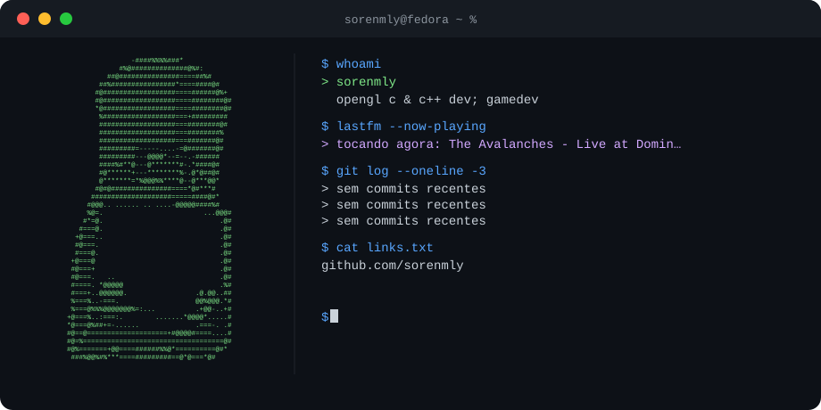

> `sudo rm -rf`

# hello

c, c++, opengl, math, phylosophy & rock/metal music

builder of small things. lover of low-level code and old prayers. 
currently somewhere between a segfault and a grace.

programmer && musicist && gamedev

---

## languages i use

---

## studying now

- **GLSL & OpenGL** . light, shadow, and everything in between
- **linear algebra & vector math** . that math that makes pixels move
- **the catholic faith** . just trying to be better.

---

## find me

---

\**M/L/Y φ — it was real. not just a delusion of the early mornings.*

